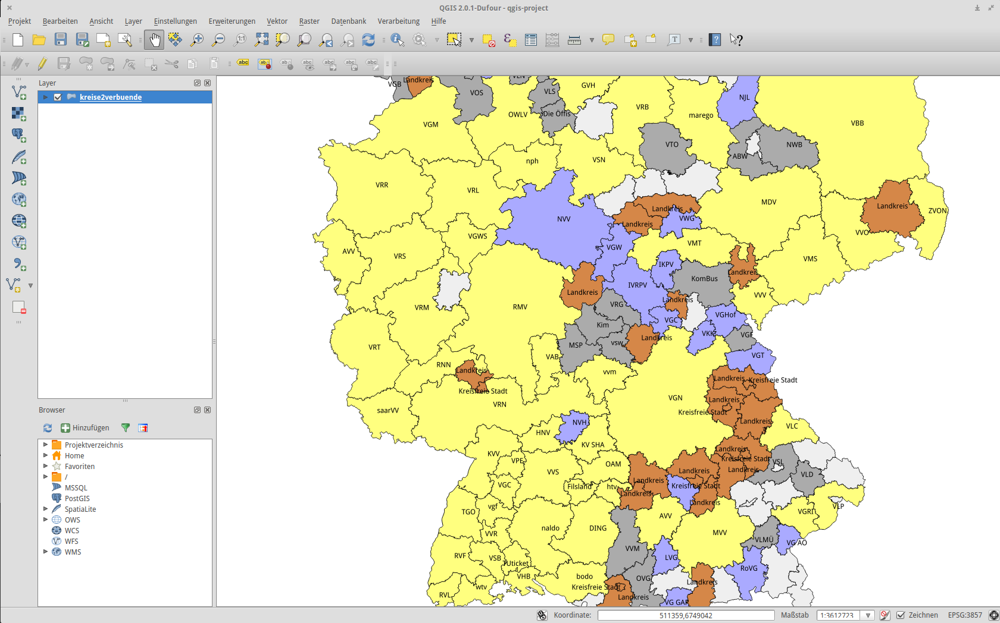

# verbundkarte

# This map has been deprecated (for years)

While creating this map by hand was a fun exercise, I never came around to maintaining it and keeping it up to date – which is arguably the most valuable part of such a project. Fortunately, the late Alexey Valikov aka highsource picked up on the idea and maintained [his Verbundkarte at highsource/verbundkarte](https://github.com/highsource/verbundkarte).

## Historic description

**What is this?** – I could not find a decent machine-readable(!) map of all transit authorities in Germany (_nb, the German [Verkehrsverbund](https://de.wikipedia.org/wiki/Verkehrsverbund) system is a rather unique beast, see [Pucher and Kurth 1995 for reference](http://www.sciencedirect.com/science/article/pii/0967070X9500022I)_)

While Wikimedia Commons has a [pixel-based map](https://commons.wikimedia.org/wiki/File:Karte_der_Verkehrsverbünde_und_Tarifverbände_in_Deutschland.png), I wanted something GeoJSONy that can be used with Leaflet or something like that.

## How was this made?

The **intelligent approach** would have been to supply the [Wikidata](https://www.wikidata.org/wiki/Wikidata:Main_Page) object of each *Verbund* with the necessary information to automatically pull all areas of all Verbünde out of there.

Sadly I have no clue how to do this.

So I took the **manual approach** and

 * downloaded the [administrative districts](http://opendatalab.de/projects/geojson-utilities/)
 * imported the resulting GeoJSON into [QGIS](http://www.qgis.org/de/site/) and saved the layer as a Shapefile
 * manually merged all districts if they belong to one and only one Verbund
 * added additional columns for districts without an associated Verkehrsverbund and to discriminate Verbünde with and without Schienenpersonennahverkehrsintegration (you've got to love German, huh?)

## What is still missing

I'd like the data to include URLs to GTFS feeds (if available) and EFA and/or HAFAS endpoints (dito). Also, some Verbünde more or less cut districts in half, which also needs to be taken care of

## How to contribute

Do it!
